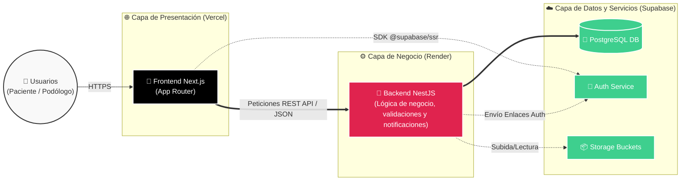

# Arquitectura del Sistema — Prospera Digital

> **Tip:** Para pegar en [mermaid.live](https://mermaid.live), copia SOLO el contenido entre las líneas `---INICIO---` y `---FIN---`.

---INICIO---

---FIN---

## Leyenda

| Capa | Tecnología | Despliegue | Responsabilidad |
|------|-----------|------------|-----------------|
| **Presentación** | Next.js 14 | Vercel | Renderizado de UI e interacción del usuario. Gestiona la sesión segura en cliente/servidor (SSR). |
| **Negocio** | NestJS | Render | Recibe las peticiones, procesa las reglas del negocio (ej. agendas, correos) y centraliza la comunicación con la BD. |
| **Datos / BaaS** | Supabase | Supabase | Provee la persistencia de datos (PostgreSQL), el manejo de identidades (Auth) y el almacenamiento (Storage Buckets). |

## Flujos principales

1. **Interacción del Usuario:** El usuario interactúa únicamente con el **Frontend (Next.js)** a través de su navegador.
2. **Centralización Lógica:** La inmensa mayoría de acciones del Frontend (reservar citas, cancelar) se procesan mediante llamadas REST API al **Backend (NestJS)**.
3. **Optimización con BaaS (Backend as a Service):** Como excepción premeditada, operaciones como el *reseteo o actualización final de la contraseña*, son gestionadas íntegramente por el **Frontend** apuntando directo al **Auth Service de Supabase** (línea punteada). Esto descarga el tráfico de seguridad en el backend, aprovechando la infraestructura manejada por Supabase.
4. **Persistencia y Nube:** Es el **Backend en NestJS** quien interactúa directamente con la Base de datos relacional y los buckets de almacenamiento como fuente de verdad.
